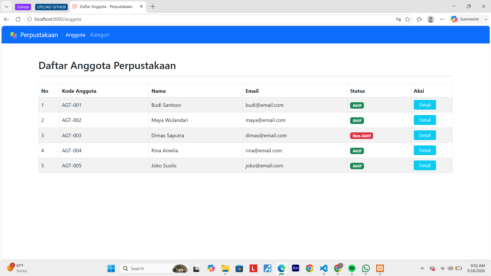
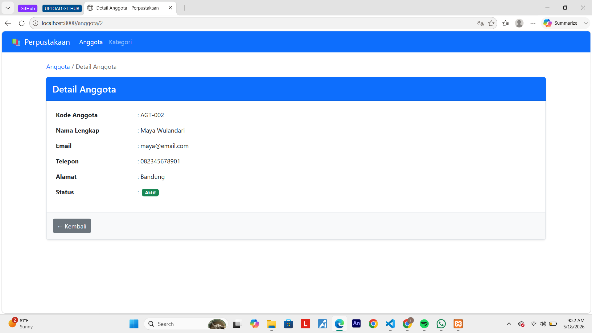
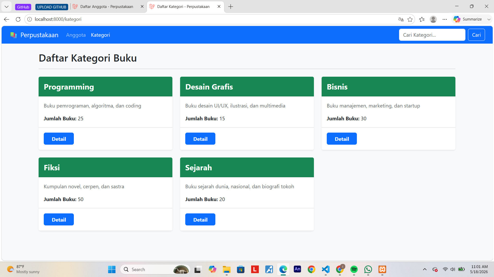
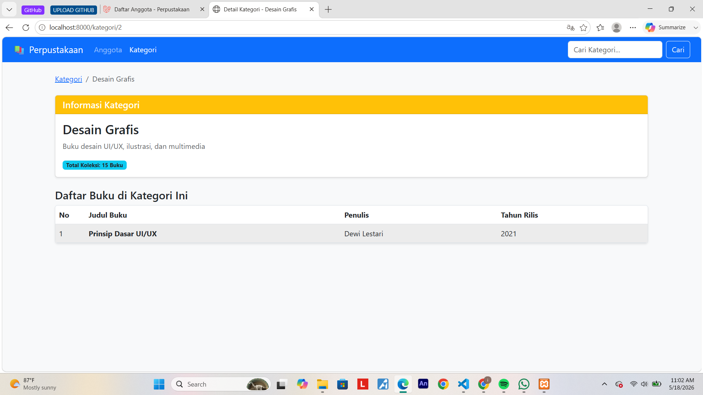
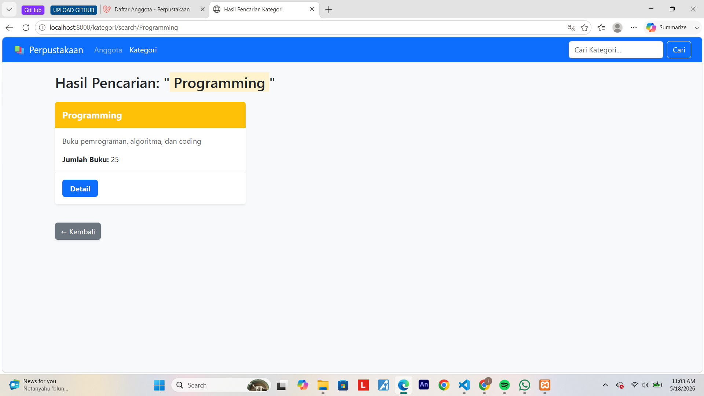

# Tugas Pertemuan 9 - Pengenalan Framework Laravel MVC

---

**Nama:** Isnaeni Kholifatun  
**NIM:** 60324075  
**Prodi:** Informatika  
**Semester:** 4  
**Mata Kuliah:** Pemrograman Web II  
**Repository:** [Link GitHub](https://github.com/username-kamu/nama-repo)

---

## Tugas 1 - Routing dan View Anggota

### Route yang dibuat:

| Method | URL | Keterangan |
| :--- | :--- | :--- |
| GET | `/anggota` | Daftar semua anggota |
| GET | `/anggota/{id}` | Detail anggota |

### Screenshot :

#### 1. Tampilan Daftar Anggota Perpustakaan (`/anggota`)

#### 2. Tampilan Detail Anggota Perpustakaan (`/anggota/{2}`)

## Tugas 2 - Controller Kategori

### Controller: `KategoriController`

* `index()` - Menampilkan daftar kategori
* `show($id)` - Menampilkan detail kategori + daftar buku
* `search($keyword)` - Mencari kategori berdasarkan keyword

### Route yang dibuat:

| Method | URL | Controller | Keterangan |
| :--- | :--- | :--- | :--- |
| GET | `/kategori` | `KategoriController@index` | Daftar kategori |
| GET | `/kategori/{id}` | `KategoriController@show` | Detail kategori |
| GET | `/kategori/search/{keyword}` | `KategoriController@search` | Cari kategori |

### Screenshot :

#### 1. Tampilan Daftar Kategori Perpustakaan (`/kategori`)

#### 2. Detail Kategori Perpustakaan (`/kategori/{id}`)

#### 3. Hasil Search Buku (`/kategori/search/programming`)
